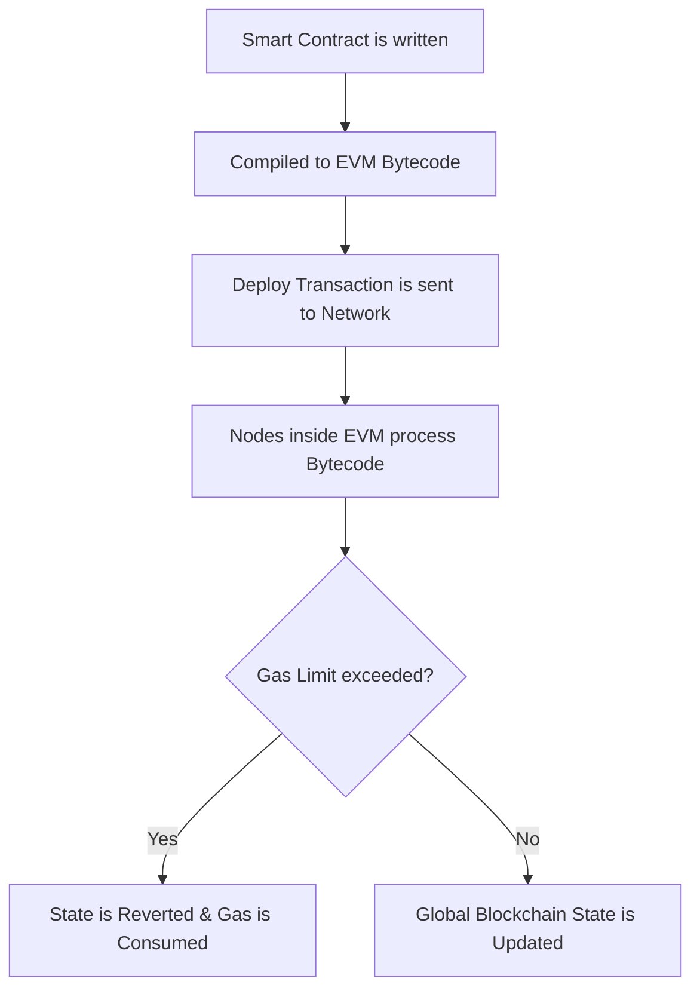
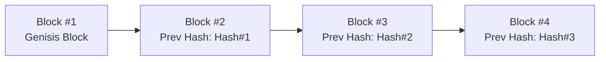
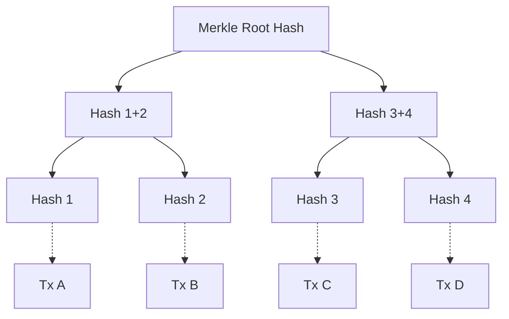

# Core Programming Concepts for Blockchain Development

## Introduction
The **Core Programming Concepts for Blockchain Development** session is designed to bridge the gap between traditional software engineering and the paradigm-shifting world of decentralized applications (dApps) and Web3. 

Blockchain technology has fundamentally transformed how trust, data integrity, and value transfer are viewed over the internet. However, building on a blockchain—such as Ethereum, Binance Smart Chain, or Polkadot—requires a dramatic shift in programming paradigms. In traditional environments, computing resources are typically cheap and abundant, and fixing a bug usually involves pushing a patch to centralized servers. In blockchain environments, specifically when smart contracts are written, deployed code is permanent, computation is expensive (costing real money via "gas"), and security vulnerabilities can lead to irreversible financial losses.

Foundational concepts are provided in this document, delivering the theoretical knowledge and practical skills needed to write robust, efficient, and secure smart contracts. Upon completion of this session, not only will the *"how"* of blockchain programming be understood, but more importantly, the *"why"* will be grasped.

### Session Objectives
After this session and the interactive lab are completed, the following capabilities will be achieved:
1. **Differentiate** between traditional centralized execution and the distributed Ethereum Virtual Machine (EVM).
2. **Identify** and understand the role of blockchain-specific data structures like Merkle Trees, Linked Lists, and Solidity Mappings.
3. **Apply** cryptographic primitives like Keccak-256 and public-key asymmetric cryptography to verify data integrity and build secure systems.
4. **Develop** smart contracts using Solidity, understanding visibility modifiers, event logs, and access control.
5. **Optimize** blockchain state storage and computation to minimize "Gas" fees.
6. **Defend** against common smart contract vulnerabilities like Reentrancy and Denial of Service (DoS) using established design patterns.

---

## Module 1: Programming Fundamentals for Blockchain

To understand blockchain programming, it must first be established how standard programming concepts map to the blockchain environment.

### 1.1 The Execution Environment (EVM and Beyond)
In traditional programming, code is run on a local machine, a virtual machine, or a cloud server (like AWS or Azure). In many blockchains (like Ethereum), code is run on the **Ethereum Virtual Machine (EVM)**—a globally distributed, quasi-Turing complete state machine. 
* **State Machine:** The blockchain transitions from one state to the next only when valid transactions are processed.
* **Turing Completeness:** Languages like Solidity can computationally solve any problem, but loops and recursions are artificially bounded by "Gas" (the cost of execution) to prevent infinite loops from freezing the network.

**EVM Execution Flow:**

### 1.2 State vs. Local Variables
Because the blockchain acts essentially as a globally shared database, an understanding of where variables live is critical.

* **State Variables:** These are variables whose values are permanently stored in the contract's storage on the blockchain. Modifying a state variable physically alters the blockchain's state, requiring a transaction and consuming gas. State variables can be thought of as database fields.
* **Local Variables:** These are variables declared inside a function and are not stored on the blockchain. They exist only temporarily while the function is executing. They are much cheaper to use because they exist only in memory.
* **Global Variables:** In a blockchain, special global variables exist that provide information about the current blockchain context. Examples include `msg.sender` (the address calling the function), `msg.value` (the amount of cryptocurrency sent with the call), and `block.timestamp` (the current block's time).

### 1.3 Determinism
A core requirement for blockchain programming is **determinism**. A function taking the same inputs must *always* yield the exact same output across all thousands of nodes in the network that verify the transaction. 
Therefore, blockchain environments cannot rely on true randomness (like hardware noise), external API calls (without special 'Oracle' networks), or typical CPU-based system clocks in the same way traditional programs do.

### 1.4 Immutability and Upgradability
Once a smart contract is deployed to the blockchain, its code cannot be changed. If a bug is present, the old file cannot simply be "overwritten". 
* Traditional Dev: "Iterate fast and break things."
* Blockchain Dev: "Measure twice, cut once."
Architectural patterns (like Proxy Contracts) are used by developers to simulate "upgrading" by deploying new logic contracts and pointing the data storage mapping to the new logic, but the fundamental immutability of the deployed bytecode remains.

---

## Module 2: Data Structures Used in Blockchain

An understanding of how data is structured both *on the ledger* and *within smart contracts* is critical. Unique data structures are used by blockchains to maintain cryptographic security and optimize storage.

### 2.1 The Linked List (The Blockchain itself)
The macroscopic data structure of a blockchain is essentially a backward-linked list.
* **Blocks as Nodes:** Each block contains a batch of transactions.
* **Cryptographic Pointers:** Instead of standard memory pointers, each block contains the cryptographic hash of the *previous* block. This creates a chain. If one bit of data in an older block changes, its hash changes, which invalidates the subsequent block's pointer, visually breaking the chain.

### 2.2 Merkle Trees (Hash Trees)
To verify transactions without downloading the entire blockchain (a process used by "Light Clients"), **Merkle Trees** are utilized.
A Merkle Tree is a binary tree of hashes. 
1. Every transaction in a block is hashed (the leaf nodes).
2. Pairs of hashes are concatenated and hashed together to form the parent nodes.
3. This process is repeated up the tree until a single **Merkle Root** is formed.

**Why it is important:** The Merkle Root is stored in the block header. If any single transaction is altered, its hash changes, causing a cascading effect that alters the Merkle Root. This allows a client to verify a transaction exists in a block in logarithmic time $O(\log N)$ by only downloading a branch of hashes, rather than all transactions in the block.

### 2.3 Mappings (Hash Tables/Dictionaries)
Inside a smart contract (e.g., Solidity), the most powerful and widely used data structure is the **Mapping**. 
A mapping is essentially a hash table that acts as a virtually initialized associative array.
* **Syntax Concept:** `mapping(_KeyType => _ValueType)`
* **How it works:** Mappings do not store keys, nor do they have a defined length. Instead, the `_KeyType` data is hashed using Keccak256, and the resulting hash serves as the exact storage slot address where the `_ValueType` is kept. 
* **Use Case:** Tracking token balances. For example, `mapping(address => uint256) public balances;` stores the number of tokens (uint256) associated with a specific wallet address.

### 2.4 Structs and Arrays
* **Structs:** Similar to C or Rust, custom types can be composed by grouping differing data types together. Structs are perfect for representing complex entities like a User, a Product, or a Vote.
* **Arrays:** Both fixed-size and dynamic-size arrays are supported by blockchains. However, extreme caution must be exercised with dynamic arrays. Iterating over a dynamic array that grows too large can cause a transaction to run out of gas and fail completely.

### 2.5 The Patricia Trie (Ethereum Specific)
While simple blockchains like Bitcoin use standard Merkle trees, a **Modified Merkle Patricia Trie** is used by Ethereum. The global state (account balances, smart contract data) is managed by this structure by combining the cryptographic verification of a Merkle tree with the path-based lookup efficiency of a Patricia trie. This allows Ethereum accounts to be rapidly updated and verified.
